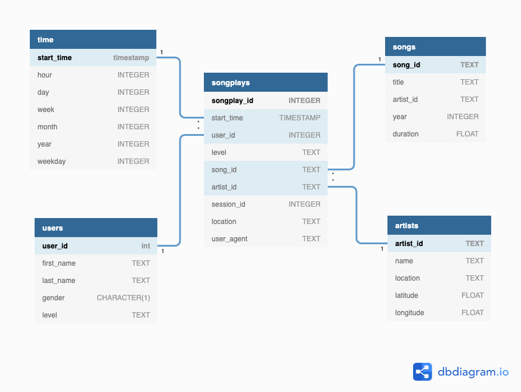

# **Sparkify Cloud Data Warehouse**
A music streaming startup, Sparkify, has grown their user base and song database and want to move their processes and data onto the cloud. Their data resides in S3, in a directory of JSON logs on user activity on the app, as well as a directory with JSON metadata on the songs in their app.

As their data engineer, I'm tasked with building an ETL pipeline that extracts their data from S3, stages them in Redshift, and transforms data into a set of dimensional tables for their analytics team to continue finding insights in what songs their users are listening to. You'll be able to test your database and ETL pipeline by running queries given to you by the analytics team from Sparkify and compare your results with their expected results.
  
  
## **Project Overview**
In this project, I'll apply what you've learned on data warehouses and AWS to build an ETL pipeline for a database hosted on Redshift. To complete the project, I will need to load data from S3 to staging tables on Redshift and execute SQL statements that create the analytics tables from these staging tables.


## **PreRequisites**
  * [Python ~3.7](https://www.python.org/)
  * AWS account

  ### Important **pip** packages used in this project
  * [psycopg2](https://pypi.org/project/psycopg2/)
  * [Pandas](https://pypi.org/project/pandas/)
  * [boto3](https://pypi.org/project/boto3/)
## **Project Datasets**

### **Song Dataset**
I'll be working with two datasets that reside in S3. Here are the S3 links for each:
```
Song data: s3://udacity-dend/song_data
Log data: s3://udacity-dend/log_data
Log data json path: s3://udacity-dend/log_json_path.json
```

The first dataset is a subset of real data from the [Million Song Dataset](https://labrosa.ee.columbia.edu/millionsong/). Each file is in JSON format and contains metadata about a song and the artist of that song. The files are partitioned by the first three letters of each song's track ID. For example, here are filepaths to two files in this dataset.
```
song_data/A/B/C/TRABCEI128F424C983.json
song_data/A/A/B/TRAABJL12903CDCF1A.json
```
And below is an example of what a single song file, TRAABJL12903CDCF1A.json, looks like.
```
{
"num_songs":           1,
"artist_id":            "ARJIE2Y1187B994AB7",
"artist_latitude":      null,
"artist_longitude":     null,
"artist_location":      "",
"artist_name":          "Line Renaud",
"song_id":              "SOUPIRU12A6D4FA1E1",
"title":                "Der Kleine Dompfaff",
"duration":             152.92036,
"year":                 0
}
```

### **Log Dataset**
The second dataset consists of log files in JSON format generated by this [event simulator](https://github.com/Interana/eventsim) based on the songs in the dataset above. These simulate activity logs from a music streaming app based on specified configurations.

The log files in the dataset you'll be working with are partitioned by year and month. For example, here are filepaths to two files in this dataset.
```
log_data/2018/11/2018-11-12-events.json
log_data/2018/11/2018-11-13-events.json
```
And below is an example of what the data in a log file, 2018-11-12-events.json, looks like.


## **Schema for Song Play Analysis**

Using the song and log datasets, you'll need to create a star schema optimized for queries on song play analysis. This includes the following tables.
 
> ### **Fact Table**
> **songplays** - records in log data associated with song plays i.e. records with page NextSong

> ### **Dimension Tables**
> 1. **users** - users in the app
> 2. **songs** - songs in music database
> 3. **artists** - artists in music database
> 4. **time** - timestamps of records in songplays broken down into specific units

Instructions
You will need to create a configuration file with the file name dwh.cfg and the following structure:
```
[CLUSTER]
HOST=<your_host>
DB_NAME=<your_db_name>
DB_USER=<your_db_user>
DB_PASSWORD=<your_db_password>
DB_PORT=<your_db_port>
DB_REGION=<your_db_region>
CLUSTER_IDENTIFIER=<your_cluster_identifier>

[IAM_ROLE]
ARN=<your_iam_role_arn>

[S3]
LOG_DATA='s3://udacity-dend/log_data'
LOG_JSONPATH='s3://udacity-dend/log_json_path.json'
SONG_DATA='s3://udacity-dend/song_data'

[AWS]
ACCESS_KEY=<your_access_key>
SECRET_KEY=<your_secret_key>
```

## **How to run?**
* Run `create_tables.py` to create your database and tables.
* Run `etl.py` to build an ETL pipeline.

## **If you're running into issues:**
contact me on [twitter](https://www.twitter.com/harshsahu97/)
